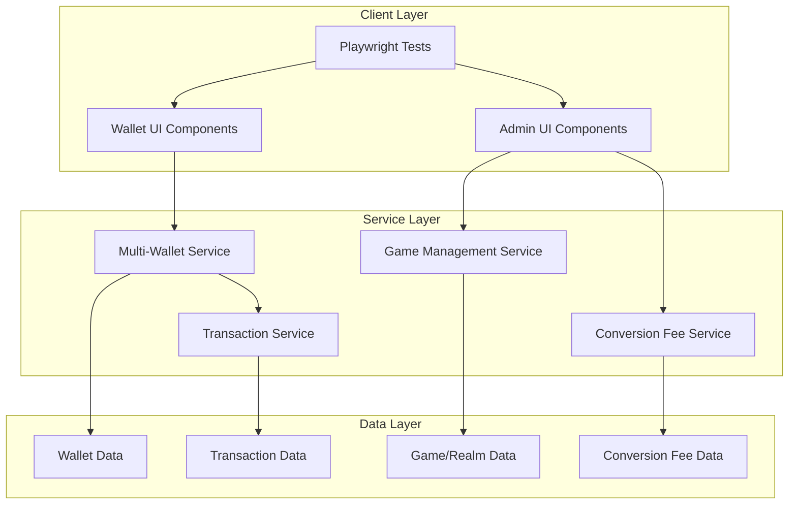
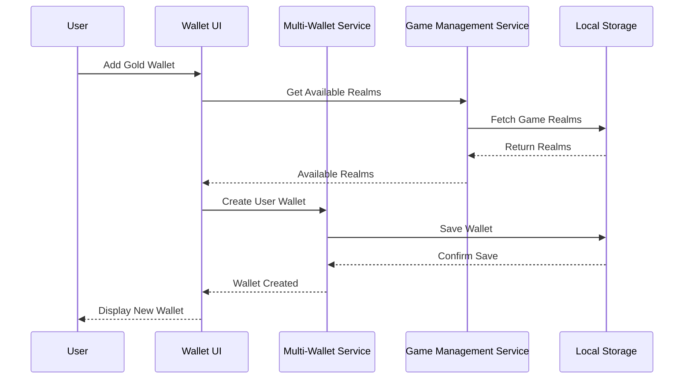
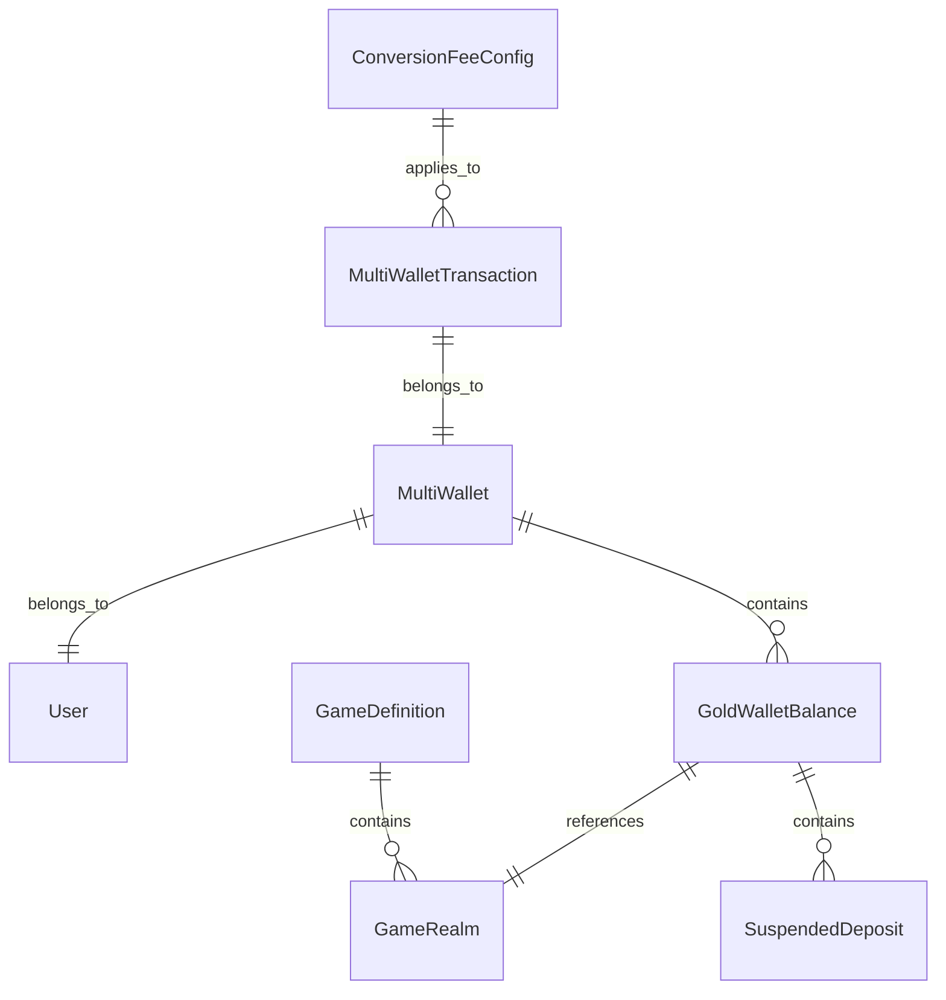

# Multi-Wallet System Design Document

## Overview

The Multi-Wallet System is a comprehensive redesign of the current wallet architecture that transforms the static 3-currency system (Gold, USD, Toman) into a dynamic, scalable wallet management system. The new system maintains two static fiat wallets (USD and Toman) while introducing unlimited dynamic game-specific gold wallets that users can add based on admin-configured game realms.

Key features include:
- Admin management of games and realms
- Dynamic gold wallet creation and management
- Suspended vs withdrawable gold tracking
- Conversion fees for early access to suspended funds
- Comprehensive transaction history per wallet
- Playwright test coverage for all functionality

## Architecture

### High-Level Architecture



### Data Flow Architecture



## Components and Interfaces

### Core Data Models

#### Enhanced Wallet Interface
```typescript
interface MultiWallet {
  userId: string;
  staticWallets: {
    usd: StaticWalletBalance;
    toman: StaticWalletBalance;
  };
  goldWallets: Record<string, GoldWalletBalance>; // key: realmId
  updatedAt: Date;
}

interface StaticWalletBalance {
  balance: number;
  currency: 'usd' | 'toman';
}

interface GoldWalletBalance {
  realmId: string;
  realmName: string;
  gameName: string;
  suspendedGold: number;
  withdrawableGold: number;
  totalGold: number; // calculated: suspended + withdrawable
  suspendedDeposits: SuspendedDeposit[];
}

interface SuspendedDeposit {
  id: string;
  amount: number;
  depositedAt: Date;
  withdrawableAt: Date; // depositedAt + 2 months
  depositedBy: string; // admin user ID
  status: 'suspended' | 'withdrawable';
}
```

#### Game and Realm Management
```typescript
interface GameRealm {
  id: string;
  gameId: string;
  gameName: string;
  realmName: string;
  displayName: string; // e.g., "Kazzak Gold"
  isActive: boolean;
  createdAt: Date;
  createdBy: string;
}

interface GameDefinition {
  id: string;
  name: string;
  slug: string;
  icon: string;
  isActive: boolean;
  realms: GameRealm[];
  createdAt: Date;
}
```

#### Enhanced Transaction Model
```typescript
interface MultiWalletTransaction {
  id: string;
  userId: string;
  walletType: 'static' | 'gold';
  walletId: string; // currency for static, realmId for gold
  type: 'deposit' | 'withdrawal' | 'conversion' | 'purchase' | 'earning' | 'admin_deposit';
  amount: number;
  currency: 'usd' | 'toman' | 'gold';
  goldType?: 'suspended' | 'withdrawable'; // for gold transactions
  status: 'pending' | 'completed' | 'failed' | 'pending_approval';
  conversionFee?: number; // for suspended gold conversions
  fromWallet?: string; // for conversions
  toWallet?: string; // for conversions
  paymentMethod?: string;
  approvedBy?: string;
  metadata?: Record<string, any>;
  createdAt: Date;
}
```

#### Conversion Fee Configuration
```typescript
interface ConversionFeeConfig {
  id: string;
  suspendedGoldToUsd: number; // percentage (e.g., 5.0 for 5%)
  suspendedGoldToToman: number; // percentage
  isActive: boolean;
  updatedBy: string;
  updatedAt: Date;
}
```

### Service Layer Components

#### Multi-Wallet Service
```typescript
class MultiWalletService {
  // Wallet Management
  static getMultiWallet(userId: string): MultiWallet;
  static createGoldWallet(userId: string, realmId: string): Promise<MultiWallet>;
  static removeGoldWallet(userId: string, realmId: string): Promise<MultiWallet>;
  
  // Balance Operations
  static updateStaticBalance(userId: string, currency: 'usd' | 'toman', amount: number): Promise<MultiWallet>;
  static updateGoldBalance(userId: string, realmId: string, suspendedAmount: number, withdrawableAmount: number): Promise<MultiWallet>;
  
  // Suspended Gold Management
  static addSuspendedGold(userId: string, realmId: string, amount: number, adminId: string): Promise<MultiWallet>;
  static processSuspendedGoldExpiry(): Promise<void>;
  static getSuspendedGoldStatus(userId: string, realmId: string): SuspendedDeposit[];
  
  // Conversions with Fees
  static convertSuspendedGoldToFiat(userId: string, realmId: string, amount: number, targetCurrency: 'usd' | 'toman'): Promise<{transaction: MultiWalletTransaction; wallet: MultiWallet}>;
  static convertBetweenGoldWallets(userId: string, fromRealmId: string, toRealmId: string, amount: number, goldType: 'suspended' | 'withdrawable'): Promise<{transaction: MultiWalletTransaction; wallet: MultiWallet}>;
}
```

#### Game Management Service
```typescript
class GameManagementService {
  // Game Operations
  static createGame(name: string, slug: string, icon: string, adminId: string): Promise<GameDefinition>;
  static updateGame(gameId: string, updates: Partial<GameDefinition>, adminId: string): Promise<GameDefinition>;
  static deactivateGame(gameId: string, adminId: string): Promise<GameDefinition>;
  static getAllGames(): GameDefinition[];
  
  // Realm Operations
  static createRealm(gameId: string, realmName: string, adminId: string): Promise<GameRealm>;
  static updateRealm(realmId: string, updates: Partial<GameRealm>, adminId: string): Promise<GameRealm>;
  static deactivateRealm(realmId: string, adminId: string): Promise<GameRealm>;
  static getGameRealms(gameId: string): GameRealm[];
  static getAllActiveRealms(): GameRealm[];
}
```

#### Conversion Fee Service
```typescript
class ConversionFeeService {
  static getConversionFeeConfig(): ConversionFeeConfig;
  static updateConversionFees(usdFee: number, tomanFee: number, adminId: string): Promise<ConversionFeeConfig>;
  static calculateConversionFee(amount: number, targetCurrency: 'usd' | 'toman'): number;
  static applyConversionFee(amount: number, targetCurrency: 'usd' | 'toman'): {convertedAmount: number; feeAmount: number};
}
```

### UI Components

#### User Interface Components
```typescript
// Enhanced Wallet Balance Display
interface MultiWalletBalanceProps {
  wallet: MultiWallet;
  loading?: boolean;
}

// Gold Wallet Management
interface GoldWalletManagerProps {
  availableRealms: GameRealm[];
  userWallet: MultiWallet;
  onAddWallet: (realmId: string) => void;
  onRemoveWallet: (realmId: string) => void;
}

// Suspended Gold Display
interface SuspendedGoldDisplayProps {
  goldWallet: GoldWalletBalance;
  onConvertToFiat: (amount: number, currency: 'usd' | 'toman') => void;
}

// Conversion Fee Calculator
interface ConversionFeeCalculatorProps {
  amount: number;
  targetCurrency: 'usd' | 'toman';
  onConfirmConversion: (amount: number, fee: number) => void;
}
```

#### Admin Interface Components
```typescript
// Game Management Panel
interface GameManagementPanelProps {
  games: GameDefinition[];
  onCreateGame: (game: Omit<GameDefinition, 'id' | 'createdAt'>) => void;
  onUpdateGame: (gameId: string, updates: Partial<GameDefinition>) => void;
  onDeactivateGame: (gameId: string) => void;
}

// Realm Management Panel
interface RealmManagementPanelProps {
  gameId: string;
  realms: GameRealm[];
  onCreateRealm: (realm: Omit<GameRealm, 'id' | 'createdAt'>) => void;
  onUpdateRealm: (realmId: string, updates: Partial<GameRealm>) => void;
  onDeactivateRealm: (realmId: string) => void;
}

// Admin Gold Deposit Panel
interface AdminGoldDepositPanelProps {
  users: User[];
  availableRealms: GameRealm[];
  onDepositGold: (userId: string, realmId: string, amount: number) => void;
}

// Gold Deposit History Panel
interface GoldDepositHistoryPanelProps {
  deposits: SuspendedDeposit[];
  filters: {
    userId?: string;
    realmId?: string;
    status?: 'suspended' | 'withdrawable';
  };
  onFilterChange: (filters: any) => void;
}

// Conversion Fee Configuration
interface ConversionFeeConfigPanelProps {
  config: ConversionFeeConfig;
  onUpdateFees: (usdFee: number, tomanFee: number) => void;
}
```

## Data Models

### Storage Schema

#### Local Storage Keys
```typescript
const MULTI_WALLET_STORAGE_KEYS = {
  MULTI_WALLETS: 'multi_wallets',
  GAME_DEFINITIONS: 'game_definitions',
  GAME_REALMS: 'game_realms',
  MULTI_WALLET_TRANSACTIONS: 'multi_wallet_transactions',
  CONVERSION_FEE_CONFIG: 'conversion_fee_config',
  SUSPENDED_DEPOSITS: 'suspended_deposits'
} as const;
```

#### Data Relationships


### Migration Strategy

#### Phase 1: Data Structure Migration
```typescript
class WalletMigrationService {
  static migrateToMultiWallet(oldWallet: Wallet): MultiWallet {
    return {
      userId: oldWallet.userId,
      staticWallets: {
        usd: { balance: oldWallet.balances.usd, currency: 'usd' },
        toman: { balance: oldWallet.balances.toman, currency: 'toman' }
      },
      goldWallets: {
        // Migrate existing gold to a default "General Gold" wallet
        'default-gold': {
          realmId: 'default-gold',
          realmName: 'General Gold',
          gameName: 'Multi-Game',
          suspendedGold: 0,
          withdrawableGold: oldWallet.balances.gold,
          totalGold: oldWallet.balances.gold,
          suspendedDeposits: []
        }
      },
      updatedAt: new Date()
    };
  }
}
```

## Error Handling

### Error Types and Handling Strategy

```typescript
enum MultiWalletErrorType {
  INSUFFICIENT_BALANCE = 'INSUFFICIENT_BALANCE',
  WALLET_NOT_FOUND = 'WALLET_NOT_FOUND',
  REALM_NOT_FOUND = 'REALM_NOT_FOUND',
  DUPLICATE_WALLET = 'DUPLICATE_WALLET',
  SUSPENDED_GOLD_RESTRICTION = 'SUSPENDED_GOLD_RESTRICTION',
  CONVERSION_FEE_ERROR = 'CONVERSION_FEE_ERROR',
  INVALID_TRANSACTION = 'INVALID_TRANSACTION'
}

class MultiWalletError extends Error {
  constructor(
    public type: MultiWalletErrorType,
    message: string,
    public details?: Record<string, any>
  ) {
    super(message);
    this.name = 'MultiWalletError';
  }
}

// Error handling patterns
const handleWalletOperation = async (operation: () => Promise<any>) => {
  try {
    return await operation();
  } catch (error) {
    if (error instanceof MultiWalletError) {
      // Handle specific wallet errors
      switch (error.type) {
        case MultiWalletErrorType.INSUFFICIENT_BALANCE:
          showNotification('Insufficient balance for this operation', 'error');
          break;
        case MultiWalletErrorType.SUSPENDED_GOLD_RESTRICTION:
          showNotification('This gold is suspended and cannot be withdrawn directly. You can convert it to USD/Toman with fees.', 'warning');
          break;
        default:
          showNotification(error.message, 'error');
      }
    } else {
      showNotification('An unexpected error occurred', 'error');
    }
    throw error;
  }
};
```

## Testing Strategy

### Unit Testing
- Service layer methods for wallet operations
- Data model validation and transformation
- Conversion fee calculations
- Suspended gold expiry logic

### Integration Testing
- Wallet creation and management flows
- Transaction processing across multiple wallets
- Admin gold deposit and restriction workflows
- Currency conversion with fee application

### Playwright E2E Testing

#### Test Scenarios
```typescript
// User Wallet Management Tests
describe('Multi-Wallet User Interface', () => {
  test('should display static wallets (USD and Toman) by default', async ({ page }) => {
    // Test implementation
  });
  
  test('should allow adding gold wallets from available realms', async ({ page }) => {
    // Test implementation
  });
  
  test('should prevent adding duplicate gold wallets', async ({ page }) => {
    // Test implementation
  });
  
  test('should allow removing gold wallets with zero balance', async ({ page }) => {
    // Test implementation
  });
  
  test('should require confirmation for removing gold wallets with balance', async ({ page }) => {
    // Test implementation
  });
});

// Suspended Gold Tests
describe('Suspended Gold Management', () => {
  test('should display suspended and withdrawable gold separately', async ({ page }) => {
    // Test implementation
  });
  
  test('should show conversion options for suspended gold', async ({ page }) => {
    // Test implementation
  });
  
  test('should calculate and display conversion fees correctly', async ({ page }) => {
    // Test implementation
  });
  
  test('should process suspended gold to fiat conversion with fees', async ({ page }) => {
    // Test implementation
  });
});

// Admin Interface Tests
describe('Admin Game and Realm Management', () => {
  test('should allow creating new games', async ({ page }) => {
    // Test implementation
  });
  
  test('should allow adding realms to games', async ({ page }) => {
    // Test implementation
  });
  
  test('should allow depositing gold to user accounts', async ({ page }) => {
    // Test implementation
  });
  
  test('should display gold deposit history with filters', async ({ page }) => {
    // Test implementation
  });
  
  test('should allow configuring conversion fees', async ({ page }) => {
    // Test implementation
  });
});
```

### Performance Testing
- Large dataset handling (users with many gold wallets)
- Transaction history pagination and filtering
- Real-time balance updates across multiple wallets

### Accessibility Testing
- Keyboard navigation for wallet management
- Screen reader compatibility for balance displays
- Color contrast for suspended vs withdrawable gold indicators

## Implementation Considerations

### Backward Compatibility
- Maintain existing API endpoints during transition
- Gradual migration of existing wallet data
- Feature flags for enabling new wallet system per user

### Performance Optimization
- Lazy loading of gold wallet balances
- Efficient storage and retrieval of transaction history
- Caching of frequently accessed game/realm data

### Security Considerations
- Validation of admin permissions for gold deposits
- Prevention of balance manipulation through client-side changes
- Audit logging for all administrative actions

### Scalability
- Efficient data structures for users with many gold wallets
- Optimized queries for transaction history across multiple wallets
- Consideration for future expansion to other game types

This design provides a comprehensive foundation for implementing the multi-wallet system while maintaining the existing functionality and ensuring a smooth transition for users.